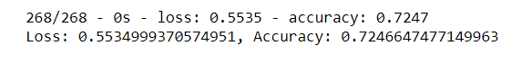
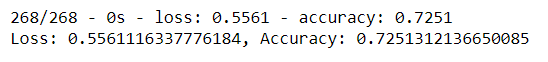

# Neural Network Charity Analysis

## Overview
The purpose of this analysis is to assist Alphabet Soup in its review of charities who have received their donations. We know that some of them are not successful. We would like to be able to predict which ones are poor prospects, so we know not to donate to them in the future.

This analysis used a charity data csv file containing information about each charity which received donations from Alphabet Soup.

## Results
***Data Preprocessing*** 

Here is how I used the variables in the CSV file:

- Target variable
	- IS_SUCCESSFUL - Was the money used effectively

- Features variables
  - APPLICATION_TYPE - Alphabet Soup application type
  - AFFILIATION - Affiliated sector of industry
  - CLASSIFICATION - Government organization classification
  - USE_CASE - Reason for funding
  - ORGANIZATION - Organization type
  - INCOME_AMT - Income classification
  - SPECIAL CONSIDERATIONS - Special consideration for application

- Neither target nor features variables
	- EIN - Identification column
	- NAME - identification column
	- STATUS - Active status (only a handful of 34,00 + were inactive )
	- ASK_AMT - Funding amount requested

***Compiling, Training, and Evaluating the Model***

Here is how I tried to optimize the model:

- **Attempt 1**: Added a third hidden layer (tanh)
  - My first hidden layer used the activation function of relu, the second one used relu, and the output layer used sigmoid. I added a third layer using tanh in order to mix it up. It did not increase the accuracy.

	  

- **Attempt 2:** Increased neurons in Layers 2 and 3
  - I increased the neurons in Layer 1 from 80 to 123, in Layer 2 from 30 to 123, and in Layer 3 from 50 to 123. I used 123 because it was 3 times the number of input values (41). It did not increase the accuracy.

	  

- **Attempt 3:** Removed columns and increased the epochs:
  - I removed the STATUS and ASK_AMT fields, thinking that Status was not relevant because so few were inactive and Ask Amount may contain outliers. I increased the epochs from 50 to 100. It did not increase the accuracy.

	    

## Summary
I was not able to achieve the target model performance of 75% accuracy. In this example, I would like to recommend a logistic regression model instead because much of the data is categorical. The logistic regression model predicts the value of a dependent variable using one or more independent variables, and will mathematically determine the probability of belonging to one of the two groups. This model is used by banks to determine whether a person does or does not qualify for a credit card, and I believe it would work well here.
